# CNN Training Workflow — CIFAR-10 From Scratch (PyTorch)

> `02_cnn-fromscratch.ipynb` ရဲ့ training process တစ်ခုလုံးကို diagram တစ်ခုထဲနဲ့ ဖော်ပြထားပါတယ်။

---

## Complete Training Workflow

```mermaid
flowchart TD
    %% ===== DATA PIPELINE =====
    subgraph DATA["📦 1. Data Pipeline"]
        direction TB
        D1[("CIFAR-10\n60K images\n3×32×32\n10 classes")]
        D1 --> D2["Train: 50K images"]
        D1 --> D3["Test: 10K images"]
        D2 --> D4["Train Split: 45K"]
        D2 --> D5["Val Split: 5K"]

        subgraph AUG["Data Augmentation — Train Only"]
            A1["RandomCrop 32, pad=4\nRandomHorizontalFlip"]
        end

        subgraph NORM["Normalization — All Sets"]
            A2["ToTensor → [0,1]\nNormalize\nμ = (0.4914, 0.4822, 0.4465)\nσ = (0.2470, 0.2435, 0.2616)\nx̂ = (x − μ) / σ"]
        end

        D4 --> AUG --> NORM
        D5 --> NORM
        D3 --> NORM

        NORM --> DL["DataLoader\nbatch_size = 64\nnum_workers = 2"]
    end

    %% ===== CNN ARCHITECTURE =====
    subgraph MODEL["🧠 2. CNN Architecture — 1.3M Parameters"]
        direction TB

        INPUT["Input\n(B, 3, 32, 32)"]

        subgraph B1["Conv Block 1: 3 → 32 channels"]
            direction LR
            B1C1["Conv2d 3×3\npad=1\n(3→32)"]
            B1BN1["BatchNorm2d\nγx̂+β"]
            B1R1["ReLU\nmax(0,x)"]
            B1C2["Conv2d 3×3\npad=1\n(32→32)"]
            B1BN2["BatchNorm2d"]
            B1R2["ReLU"]
            B1MP["MaxPool2d\n2×2"]
            B1DO["Dropout2d\n0.25"]
            B1C1 --> B1BN1 --> B1R1 --> B1C2 --> B1BN2 --> B1R2 --> B1MP --> B1DO
        end

        subgraph B2["Conv Block 2: 32 → 64 channels"]
            direction LR
            B2C1["Conv2d 3×3\npad=1\n(32→64)"]
            B2BN1["BatchNorm2d"]
            B2R1["ReLU"]
            B2C2["Conv2d 3×3\npad=1\n(64→64)"]
            B2BN2["BatchNorm2d"]
            B2R2["ReLU"]
            B2MP["MaxPool2d\n2×2"]
            B2DO["Dropout2d\n0.25"]
            B2C1 --> B2BN1 --> B2R1 --> B2C2 --> B2BN2 --> B2R2 --> B2MP --> B2DO
        end

        subgraph B3["Conv Block 3: 64 → 128 channels"]
            direction LR
            B3C1["Conv2d 3×3\npad=1\n(64→128)"]
            B3BN1["BatchNorm2d"]
            B3R1["ReLU"]
            B3C2["Conv2d 3×3\npad=1\n(128→128)"]
            B3BN2["BatchNorm2d"]
            B3R2["ReLU"]
            B3MP["MaxPool2d\n2×2"]
            B3DO["Dropout2d\n0.25"]
            B3C1 --> B3BN1 --> B3R1 --> B3C2 --> B3BN2 --> B3R2 --> B3MP --> B3DO
        end

        subgraph CLASSIF["Classifier (Fully Connected)"]
            direction LR
            FL["Flatten\n128×4×4 = 2048"]
            FC1["Linear\n2048 → 512"]
            FCBN["BatchNorm1d"]
            FCR["ReLU"]
            FCDO["Dropout\n0.5"]
            FC2["Linear\n512 → 10"]
            FL --> FC1 --> FCBN --> FCR --> FCDO --> FC2
        end

        INPUT --> B1
        B1 -- "(B, 32, 16, 16)" --> B2
        B2 -- "(B, 64, 8, 8)" --> B3
        B3 -- "(B, 128, 4, 4)" --> CLASSIF
        CLASSIF --> LOGITS["Logits\n(B, 10)\nraw scores"]
    end

    %% ===== TRAINING LOOP =====
    subgraph TRAIN["🔄 3. Training Loop — 50 Epochs"]
        direction TB

        subgraph FORWARD["Forward Pass"]
            FP1["Batch (images, labels)\nimages → model"]
            FP2["Output: logits (B, 10)"]
            FP1 --> FP2
        end

        subgraph LOSS_CALC["Loss Calculation — CrossEntropyLoss"]
            L1["CrossEntropyLoss =\nLogSoftmax + NLLLoss"]
            L2["L = −(1/N) Σ log(exp(zᵧ) / Σⱼ exp(zⱼ))"]
            L3["zᵧ = logit of true class y\nzⱼ = logit of class j"]
            L1 --> L2 --> L3
        end

        subgraph BACKWARD["Backward Pass — Backpropagation"]
            BP1["loss.backward()\n∂L/∂w for all parameters"]
            BP2["Chain Rule:\n∂L/∂w = ∂L/∂z · ∂z/∂w"]
            BP1 --> BP2
        end

        subgraph OPTIM["Optimizer — Adam"]
            OP1["Adam: lr = 0.001\nAdaptive learning rate"]
            OP2["mₜ = β₁mₜ₋₁ + (1−β₁)gₜ\nvₜ = β₂vₜ₋₁ + (1−β₂)gₜ²"]
            OP3["w = w − lr · m̂ₜ / (√v̂ₜ + ε)\nβ₁=0.9, β₂=0.999"]
            OP1 --> OP2 --> OP3
        end

        subgraph SCHED["LR Scheduler — ReduceLROnPlateau"]
            SC1["Monitor: val_loss\nPatience: 3 epochs"]
            SC2["val_loss မကျရင်\nlr = lr × 0.5"]
            SC1 --> SC2
        end

        FORWARD --> LOSS_CALC
        LOSS_CALC --> BACKWARD
        BACKWARD --> OPTIM
        OPTIM --> METRICS["Track: train_loss, train_acc\nval_loss, val_acc"]
        METRICS --> SCHED
        SCHED --> SAVE{"val_acc > best?"}
        SAVE -- "Yes" --> SAVEM["Save best_cnn_cifar10.pth\nUpdate best_val_acc"]
        SAVE -- "No" --> NEXT["Next Epoch"]
        SAVEM --> NEXT
        NEXT --> FORWARD
    end

    %% ===== EVALUATION =====
    subgraph EVAL["📊 4. Evaluation & Prediction"]
        direction TB

        E1["Load Best Model\nbest_cnn_cifar10.pth"]
        E2["Test Set: 10K images\nmodel.eval() — no dropout"]

        subgraph PREDICT["Prediction Pipeline"]
            direction LR
            P1["Input Image\n3×32×32"]
            P2["Model → Logits\n(1, 10) raw scores"]
            P3["Softmax\nσ(zᵢ) = exp(zᵢ) / Σ exp(zⱼ)\nSum = 1.0"]
            P4["argmax\nPredicted Class"]
            P1 --> P2 --> P3 --> P4
        end

        subgraph METRICS_EVAL["Evaluation Metrics"]
            M1["Test Accuracy"]
            M2["Classification Report\nPrecision, Recall, F1"]
            M3["Confusion Matrix\n10×10"]
            M4["Per-Class Accuracy"]
        end

        E1 --> E2 --> PREDICT --> METRICS_EVAL
    end

    %% ===== MAIN FLOW CONNECTIONS =====
    DATA --> MODEL
    MODEL --> TRAIN
    TRAIN -- "Training Complete\nBest Val Acc" --> EVAL

    %% ===== STYLING =====
    style DATA fill:#e8f4fd,stroke:#2196F3,stroke-width:2px
    style MODEL fill:#fff3e0,stroke:#FF9800,stroke-width:2px
    style TRAIN fill:#e8f5e9,stroke:#4CAF50,stroke-width:2px
    style EVAL fill:#fce4ec,stroke:#E91E63,stroke-width:2px
    style AUG fill:#e3f2fd,stroke:#90CAF9
    style NORM fill:#e3f2fd,stroke:#90CAF9
    style B1 fill:#fff8e1,stroke:#FFB74D
    style B2 fill:#fff8e1,stroke:#FFB74D
    style B3 fill:#fff8e1,stroke:#FFB74D
    style CLASSIF fill:#fff8e1,stroke:#FFB74D
    style FORWARD fill:#c8e6c9,stroke:#66BB6A
    style LOSS_CALC fill:#c8e6c9,stroke:#66BB6A
    style BACKWARD fill:#c8e6c9,stroke:#66BB6A
    style OPTIM fill:#c8e6c9,stroke:#66BB6A
    style SCHED fill:#c8e6c9,stroke:#66BB6A
    style PREDICT fill:#f8bbd0,stroke:#EC407A
    style METRICS_EVAL fill:#f8bbd0,stroke:#EC407A
    style LOGITS fill:#FFD54F,stroke:#FFA000,stroke-width:2px
    style SAVE fill:#FFF9C4,stroke:#FBC02D
```

---

## Math Intuitions — Key Formulas

```mermaid
flowchart LR
    subgraph CONV["Convolution Layer"]
        direction TB
        CF["Output = Σ(Input ⊛ Kernel) + Bias\nParams = (K_w × K_h × C_in × C_out) + C_out\nExample: (3×3×3×32)+32 = 896"]
    end

    subgraph BN["Batch Normalization"]
        direction TB
        BNF["x̂ = (x − μ_B) / √(σ²_B + ε)\ny = γx̂ + β\nμ_B = batch mean\nσ²_B = batch variance\nγ, β = learnable params"]
    end

    subgraph RELU_M["ReLU Activation"]
        direction TB
        RF["f(x) = max(0, x)\n∂f/∂x = 1 if x > 0\n∂f/∂x = 0 if x ≤ 0\nSolves vanishing gradient"]
    end

    subgraph POOL["Max Pooling 2×2"]
        direction TB
        PF["Output = max(2×2 region)\nReduces spatial: H/2, W/2\nNo learnable params\nTranslation invariance"]
    end

    subgraph DROP["Dropout"]
        direction TB
        DF["Train: randomly zero p fraction\nP(neuron=0) = p\nTest: multiply by (1−p)\nRegularization → prevents overfitting"]
    end

    subgraph CE["CrossEntropy Loss"]
        direction TB
        CEF["L = −log(p_y)\n= −log(exp(z_y) / Σ exp(z_j))\np_y = softmax prob of true class\nPerfect prediction → L = 0\nWrong prediction → L → ∞"]
    end

    subgraph SOFT["Softmax"]
        direction TB
        SF["σ(zᵢ) = exp(zᵢ) / Σⱼ exp(zⱼ)\nOutput ∈ (0, 1)\nΣ σ(zᵢ) = 1.0\nLarger logit → higher prob"]
    end

    subgraph ADAM["Adam Optimizer"]
        direction TB
        AF["1st moment: m = β₁m + (1−β₁)g\n2nd moment: v = β₂v + (1−β₂)g²\nBias correct: m̂ = m/(1−β₁ᵗ)\nUpdate: w -= lr·m̂/(√v̂+ε)\nCombines Momentum + RMSProp"]
    end

    CONV --> BN --> RELU_M --> POOL --> DROP --> CE --> SOFT --> ADAM

    style CONV fill:#BBDEFB,stroke:#1976D2,stroke-width:2px
    style BN fill:#C8E6C9,stroke:#388E3C,stroke-width:2px
    style RELU_M fill:#FFF9C4,stroke:#F9A825,stroke-width:2px
    style POOL fill:#D1C4E9,stroke:#7B1FA2,stroke-width:2px
    style DROP fill:#FFCCBC,stroke:#E64A19,stroke-width:2px
    style CE fill:#F8BBD0,stroke:#C2185B,stroke-width:2px
    style SOFT fill:#B2EBF2,stroke:#00838F,stroke-width:2px
    style ADAM fill:#DCEDC8,stroke:#558B2F,stroke-width:2px
```

---

## Hyperparameters Summary

| Parameter | Value | Purpose |
|-----------|-------|---------|
| `IMG_SIZE` | 32 | CIFAR-10 native resolution |
| `BATCH_SIZE` | 64 | Samples per gradient update |
| `NUM_EPOCHS` | 50 | Training iterations |
| `LEARNING_RATE` | 0.001 | Adam initial step size |
| `LR Scheduler` | ReduceLROnPlateau | lr × 0.5 if val_loss stalls 3 epochs |
| `Optimizer` | Adam (β₁=0.9, β₂=0.999) | Adaptive learning rates |
| `Loss` | CrossEntropyLoss | LogSoftmax + NLLLoss combined |
| `Train/Val/Test` | 45K / 5K / 10K | Data split |

---

## Feature Map Size Progression

```mermaid
flowchart LR
    S1["Input\n3 × 32 × 32"]
    S2["Block 1\n32 × 16 × 16"]
    S3["Block 2\n64 × 8 × 8"]
    S4["Block 3\n128 × 4 × 4"]
    S5["Flatten\n2048"]
    S6["FC\n512"]
    S7["Output\n10"]

    S1 -- "Conv+Pool" --> S2 -- "Conv+Pool" --> S3 -- "Conv+Pool" --> S4 -- "Flatten" --> S5 -- "Linear" --> S6 -- "Linear" --> S7

    style S1 fill:#E3F2FD,stroke:#1565C0,stroke-width:2px
    style S2 fill:#BBDEFB,stroke:#1565C0,stroke-width:2px
    style S3 fill:#90CAF9,stroke:#1565C0,stroke-width:2px
    style S4 fill:#64B5F6,stroke:#1565C0,stroke-width:2px,color:#fff
    style S5 fill:#42A5F5,stroke:#1565C0,stroke-width:2px,color:#fff
    style S6 fill:#2196F3,stroke:#1565C0,stroke-width:2px,color:#fff
    style S7 fill:#1976D2,stroke:#0D47A1,stroke-width:2px,color:#fff
```

> **Pattern:** Channels ↑ (3→32→64→128) while Spatial ↓ (32→16→8→4) — deeper layers capture more abstract features in smaller spatial regions.
